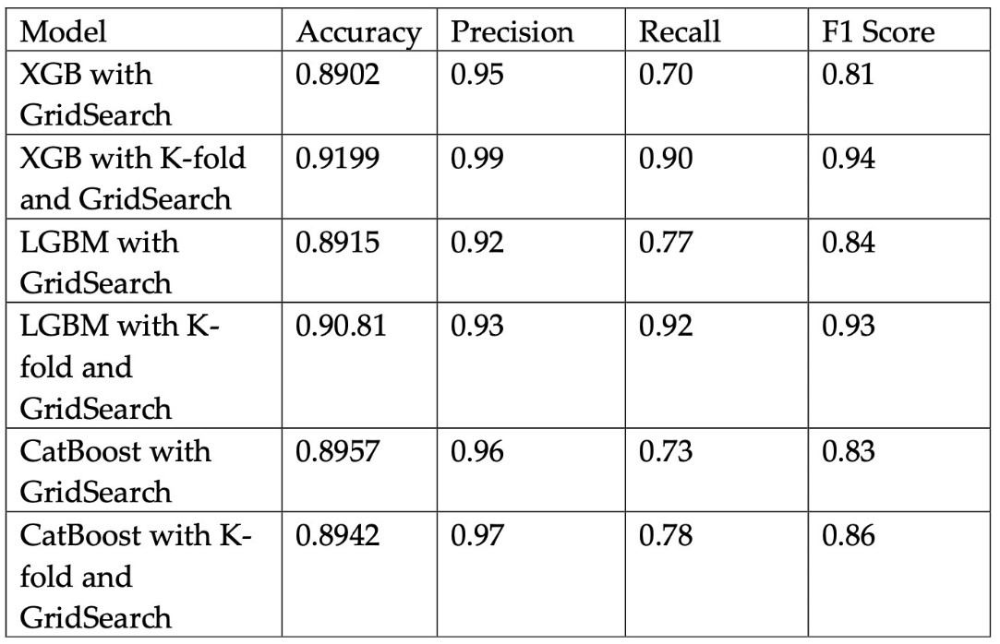

# Fraud-Detection

This project was handled to finish the Data Science Bootcamp training organized by the VBO organization. In this project, we worked as a group, and it took one month. The group members are:
- Berkan ACAR
- Mert Ozan INAL
- Muhammed CIMCI
- Ismail KAYA
- Umit CEYLAN

# Scope of The Project

The aim of the project is benchmarking machine learning models on a challenging large-scale dataset to determine if the transactions are fraud or not. 

# About Data Set
The data was published by the competition hosted by the IEEE Computational Intelligence Society [(IEEE-CIS)](https://cis.ieee.org/) on [Kaggle](https://www.kaggle.com/) in 2019. It originates from the world’s leading payment service company, [Vesta Corporation](https://trustvesta.com/). You can read about the fraud detection competition and find the data set [here.](https://www.kaggle.com/c/ieee-fraud-detection). The train set of the merged data had initially 590,540 observations and 434 variables and the test set had 506,691 observations and 433 variables, accounting for a total of 5 GB memory before pre-processing data. Hence, we apply memory reductions for the data at the beginning, during, and at the end of the pre-processing procedure.

 #  Abstract

The data set used in this project is given as 4 different CSV files, two of which are Train sets and the other two belong to the Test set. We fix the structural errors by using train set columns and combined the two data sets (id and transaction) with left join for Train and Test set. Since more than 95% of the variables given in terms of data privacy are kept confidential, we grouped the variables with different pattern determination techniques. After applying the EDA analysis to the grouped variables, we define the Userid variable to identify each person to whom the transactions belong. Based on the Userid, we performed feature engineering and obtained a Train set with the dimension of 590,540 x 284  before we start modeling. We predicted the Test set using tree-based models like XGBoost, LightGBM, and CatBoost using this Train set we obtained. We use the GridSearch method to determine the hyperparameters of these models. Then we applied Kfold cross-validation to the models using the tuned parameters and achieved higher accuracy results. The accuracy of these 3 models turned out to be very close to each other. Accuracy values of XGBoost, LightGBM and CatBoost were 91.99%, 90.81% and 89.42%, respectively.

# Pre-processing

We set all the missing values as -1 as the algorithms function more efficiently with the numerical data. However, there were also some variables with negative values. Hence we shifted up all the values of those variables with the amount of the smallest negative value of each variable to achieve our goal of separating the missing values aside.

We have captured specific missing value patterns in some variables when the missing values are visualized as the data is a 6-months time series which may consist of some very similar data. According to the correlations of the data, the pattern groups formed and dimensionality reduction was performed by removing the variables with more missing values and taking only one as the representative in each group. Especially many v columns, some d and id columns were eliminated using this method. Eliminating columns that carry almost the same information prevented us from multicollinearity problems and also this approach considerably decreased the computational dimensionality costs.

# Feature Engineering

* We define the cards with less than 2 frequencies as invalid cards and we set the observations of those card values as missing values.
* We create the Userid combining 'card1', 'P_emaildomain', and 'addr1' variables as a string. Infacy we tried many Userid variables from the cards,'P_emaildomain', and 'addr1' and finally we decided to use these three varibles as they give better AUC score in the final results.
* We extract the used browser, device OS, and the versions of the devices.
* We standardize the transaction amount and saved it as a new variable.
* We create a dummy variable that controls whether the user uses the last updated browsers.
* We extract country information from email domains and the foreign country information from the decimal length of the transaction amounts.
* We check whether the purchaser and the recipient emails have the same domain and created a dummy for this check.
* We create time variables and US h.olidays variables.
* We mean encode fraud ratios for ProductCD and M4 categories.
* We rescale  D Columns to transform them into their point in the past.
* We perform rolling window aggregations of the last ten transactions.
* We factorize categorical variables into numerical values and set their missing values as -1.
* We frequency encode 'addr1', 'card1', 'card2', 'card3', 'P_emaildomain' variables.
* We aggregate many numerical variables with respect to the Userid and finally, we dropped the Userid in order not to memorize the Train data.

# Model

The data in the data set is unbalanced and its features contain a lot of missing values. Looking at the relationship between the features, we decided to use XGBoost, LightGBM, and CatBoost, since there is no obvious relationship and overlapping. We used grid-search and Kfold methods to establish models and determine hyperparameters and compared their success.

We tested the sensitivity of Catboost model to the categorical features. The categorical feature property of Catboost was preferred as it showed very high success in each trial.

Classification report  and Confusion matrix are reported. F1, Precision, and Recall values are compared for different models.

As the model evaluation metrics we used Area Under Curve (AUC) parallel to the competition's decision. This is important because pure accuracy scores can be misleading as we want to detect very rare fraud values and AUC score is higher with high true-positive and low false-positive rates.

# Conclusion

Models and their results are given in the table below. The evaluation metric of the contest was AUC, and it seems that the best result was the XGBoost model with Kfold with 91.99% and the recall value of this model is 0.90. It was able to catch 90% of frauds. In addition LightGBM model with Kfold accuracy score is 90.81% and recall value is 0.92.  

# Further Studies

* Since the data set is big, hyperparameter tuning could not be done for vaster intervals for the hyperparameters. For example, the candidate values for n_estimators,max_depth, num_leaves, and learning rates could be tried for much more different values.

* Group K-fold can be tried for the cross-validation accuracy calculations.

* The data can be split into test and train using time series splitting. The test set ratio can be changed.
